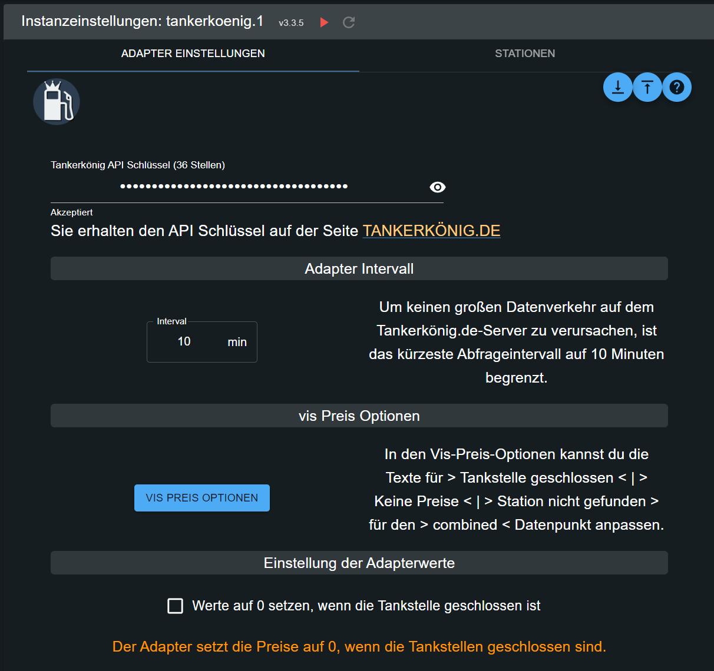
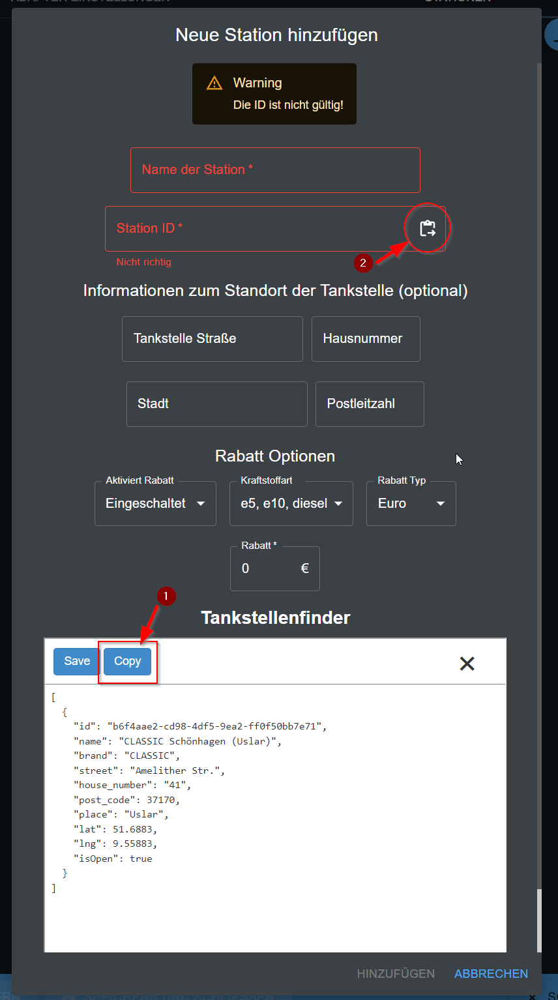
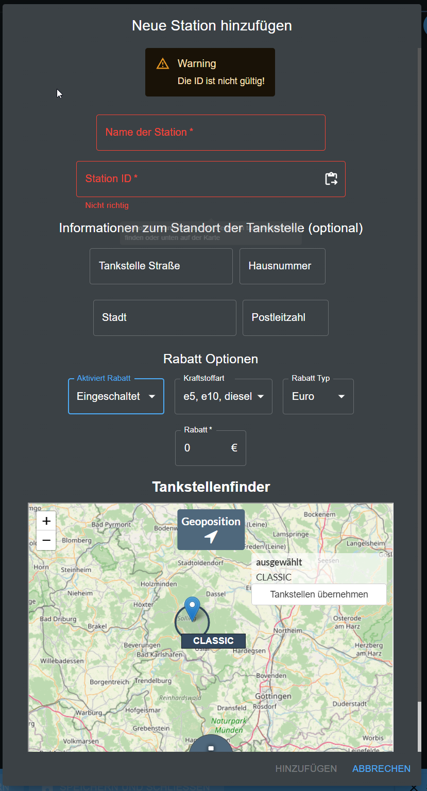
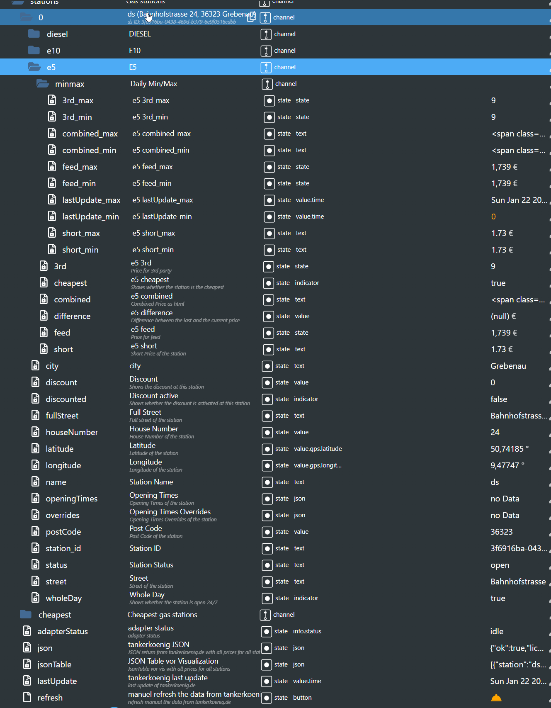

# ioBroker.tankerkoenig


 
[](https://www.npmjs.com/package/iobroker.tankerkoenig)
[](https://www.npmjs.com/package/iobroker.tankerkoenig)

[](https://nodei.co/npm/iobroker.tankerkoenig/)

**Tests:**
[](https://github.com/iobroker-community-adapters/ioBroker.tankerkoenig/actions/workflows/test-and-release.yml)


## Description
This adapter returns fuel prices for up to ten different station through a JSON feed of the web service [tankerkoenig.de](https://creativecommons.tankerkoenig.de/#about). All data is stored in objects to be used and displayed in [ioBroker.vis](https://github.com/ioBroker/ioBroker.vis).
The adapter uses the site prices.php which reduces the amount of data to be transfered when updating compared to list.php and detail.php (bulk). The adapter creates datapoints for the station that sells the cheapest E5, E10 and diesel.

## Configuration
### API key
The API key can be obtained at [website Tankerkönig](https://creativecommons.tankerkoenig.de/#about). It is a 36-digit code that has to be entered in this field.

### Stations
Up to 10 gas stations can be queried. To do this, you need to enter the gas station ID. You can get the ID for each gas station on tankerkoenig.de. It is also 36 digits long.
In addition, you can enter your own name for the station.



This window is used to add the new stations, you can read the stadium ID directly in the map below and copy it into the field above.
#### Copy station ID
There are 2 ways to copy the ID into the field:
- you mark the ID and copy it with Ctrl+C or right click copy and then paste into the field.
- you can also do it with the button `Copy`, this will copy the whole content, and you can then either paste it directly into the field. 
  Or you click on the button `Paste` then only the ID will be pasted into the field.

**But for this you have to allow the browser to access the clipboard.** (this works only if your admin is running with https and you access the page with https)


Under the discount options you can choose between the discount variants ⇨ Euro / Percent and for which fuel type the discount applies (default are all selected).


### Set values to 0
Activate this function if the prices are to be set to 0 when the gas station is closed.\
If the function is turned off, the prices will be set as invalid, see below.

### Invalid prices
If a gas station does not provide prices for E5, E10 or Diesel, e.g. if the station is closed, the price will not change, instead the state quality will be set to `Quality code 0x40 => Substitute value from device`, the state will then be displayed in orange.


## Activation
The adapter runs as a daemon (not in schedule mode) and starts regularly every five minutes. The data of the source feed are updated by the server at tankerkoenig.de only every 4 minutes, therefore a more frequent query of the data makes no sense and causes only superfluous data traffic and costs resources. Larger intervals can be set at any time.

##  Datapoints
The datapoints are created dynamically, that is, when you create a station, datapoints are created for it (maximum 10 stations).

Under the different fuel types the following datapoints are created:
* `feed` (price with three decimal places as number)
* `short` (price with two decimal places (unrounded) as string)
* `3rd` (third decimal place of the price to represent the superscript in VIS)
* `combined` (ready HTML formatted with price and superscript third decimal place or if necessary opening status [`closed`/`not found`] for easy display with VIS HTML widget)

Under each fuel type there is another folder `minmax` in which the data points for the min and max prices of the gas station are created. They are stored only for
one day and will be set to 0 and refilled the next day.

In addition, five data points are created on in the respective station:
* `discount` (discount in Euro / percent as number)
* `discounted` (shows if a discount is active or not)
* `status` (station open?)
* `name` (name of the gas station given by the user)
* `station_id` (Tanker King ID of the gas station)

Additionally the cheapest gas stations from the list are determined in the channels
* `cheapest.E5`
* `chepest.E10`
* `cheapest.diesel`

On the station level five more data points are created:
* `adapterStatus` (shows the status of the adapter possible values: `idle / automatic request / manual request / detail request / requet timeout 1min / write states / request Error / offline`)
* `json` (JSON data of the gas station)
* `jsonTable` (json table for the vis `only the json data no widget`)


* `lastUpdate` (time of the last update)
* `refresh` (This is a button to refresh the data manually `WARNING` after triggering it once it is not possible to trigger the manual refresh for 1 minute)

Within these channels, the most favorable gas station for the named fuel type is created. If several gas stations offer a fuel at the same price, the station that was entered first/at the top in the settings is output.

## VIS 
The datapoint 'combined' can be displayed easily in this VIS widget
```js
[{"tpl":"tplHtml","data":{"visibility-cond":"==","visibility-val":1,"refreshInterval":"0","gestures-offsetX":0,"gestures-offsetY":0,"signals-cond-0":"==","signals-val-0":true,"signals-icon-0":"/vis/signals/lowbattery.png","signals-icon-size-0":0,"signals-blink-0":false,"signals-horz-0":0,"signals-vert-0":0,"signals-hide-edit-0":false,"signals-cond-1":"==","signals-val-1":true,"signals-icon-1":"/vis/signals/lowbattery.png","signals-icon-size-1":0,"signals-blink-1":false,"signals-horz-1":0,"signals-vert-1":0,"signals-hide-edit-1":false,"signals-cond-2":"==","signals-val-2":true,"signals-icon-2":"/vis/signals/lowbattery.png","signals-icon-size-2":0,"signals-blink-2":false,"signals-horz-2":0,"signals-vert-2":0,"signals-hide-edit-2":false,"html":"<span style=\"font-size: 80%; padding: 0 20px 0 5px;\">Diesel</span>{tankerkoenig.0.stations.0.diesel.combined}"},"style":{"left":"634px","top":"745px","z-index":"20","width":"228px","height":"36px","background-color":"","color":"rgba(225,225,225,1)","font-size":"30px","text-align":"center","background":"rgba(250,0,0,0.1)"},"widgetSet":"basic"}]
```
The value of the datapoint `combined` deliveres a css class. These classes are `station_open`, `station_closed` and `station_notfound`. Through CSS definitions in the CSS editor in VIS now distinguished designs can be achieved (like red font color for a closed station).
```css
.station_open {
    color: blue; 
}
.station_closed {
    color: red !important; /* !important kann ggf. weggelassen werden */
}
.station_notfound {
    color: yellow !important; /* !important kann ggf. weggelassen werden */
}
.station_no_prices {
    color: yellow !important; /* !important kann ggf. weggelassen werden */
}

/* € sign */
.station_combined_euro {
    font-family: Times;
    font-size: 80%;
}
```